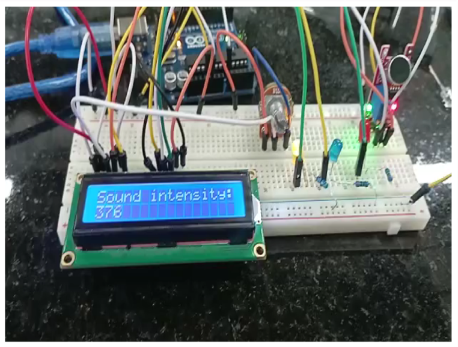

# Sound-Frequency-Analyzer-with-LCD-and-LED-Display

A project related to our University Embedded-Systems Course. The system measures the sound intensity using an analog input, displays the intensity value on an LCD, provides visual feedback through LEDs to indicate the intensity level, and transmits the measured value through UART for additional processing and monitoring.

# Components
- ATmega328 Microcontroller
- Sound Sensor
- LCD Display
- Potentiometer
- LEDs
- Three Carbon Resistors 220kΩ 
- Power Supply

# Demo

